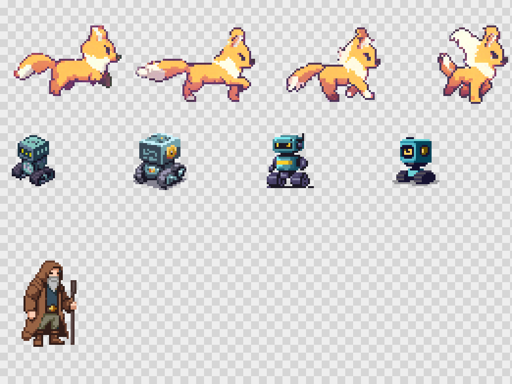
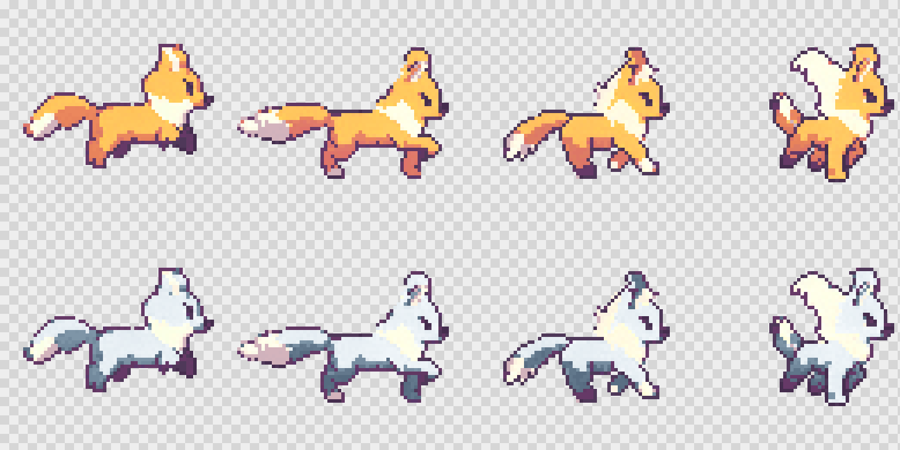
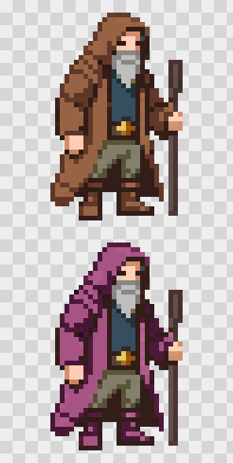
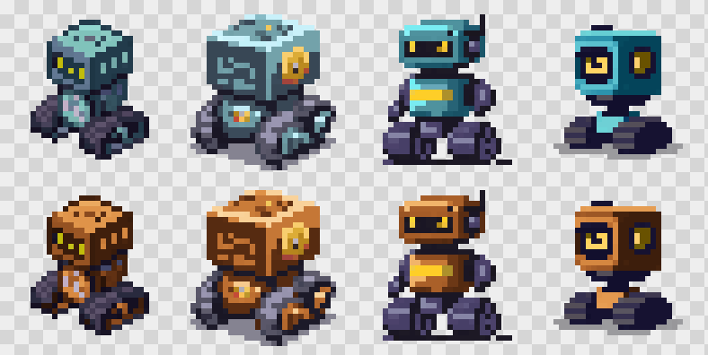

# Validation: does this generalize beyond one game?

sprite-canon was extracted from one game's pipeline. To prove the workflow isn't
overfitted to that game's art, we ran a blind trial: **three freshly AI-generated
subjects in styles, sizes, body plans and file formats the toolkit had never
seen**, each handled end-to-end by an independent agent driving the real MCP
server over stdio — no access to the core library, no knowledge of the original
game.

| Subject | Format | Size | Palette |
|---|---|---|---|
| Fox (walk animation) | animated GIF, 4 frames | 64×64 | 232 colours, warm autumn |
| Robot (4 directions) | PNG spritesheet, 32px cells | 128×32 | 126 colours, cool steel |
| Merchant | single PNG | 48×48 | 47 colours, earthy |

Each agent: `colors_inspect` → `canon_init` → `canon_learn` (regions incl.
protected) → `sprite_measure` → `sprite_repaint` → `sprite_verify` → `sprite_sheet`.

## Results

### Fox — GIF input, 232-colour anti-aliased art

Orange fur (183 colours) → arctic blue-white ramp. Shading survived; **added
jitter 0, protected 0px, leftover 0px — passed first try**. The agent then ran a
negative control: deliberately corrupting one outline colour via `gif_patch` made
the protected check fail with **exactly 291px** — the checks are not vacuous.

Caught for free: the original GIF fails its own palette check by 46px — classic
AI palette noise (23 near-duplicate colours used once or twice).

### Merchant — protected regions on a face

Brown cloak (389px) → deep purple. **All 294 protected pixels (skin, beard,
eyes, outline) byte-identical.** Negative control: a deliberately tampered beard
failed with exactly 35px — matching the census count to the pixel.

Caught for free: the boots reuse the cloak's exact hexes, so "repaint only the
cloak" is structurally impossible on this asset — a real AI-asset defect the
census exposed *before* painting.

### Robot — spritesheet input, and an honest miss

Teal metal → copper across all 4 sheet cells; cell positions preserved;
protected/leftover passed first try. The four directions are — visibly —
**four different robots** (the east one is 1.3× larger; the north one is a flat
redesign). What caught it: `jitter` (13px vs limit 2) and `sprite_measure`
(cap width 16↔21, metal area 139↔326px). What did NOT catch it: the
`spread` check (26 ≤ 48) — mean luminance is blind to shape divergence when the
palette family matches. That limitation is now on the roadmap (silhouette
comparison).

## What the trial changed

The fox agent's real animation exposed a check-semantics bug: back-view walk
frames legitimately jitter 3–5px (the only visible skin is the swinging hands),
so a pure recolour failed absolute jitter. Fixed: **with `baseFiles`, jitter now
measures ADDED jitter** — motion the original always had cannot fail a recolour.
Pinned by a regression test.

## Verdict

All three agents independently returned **works-with-friction**: the canon →
verify → repaint pipeline ran unmodified on foreign art in every container
format, passed every protected/leftover check on the first attempt, proved its
checks non-vacuous via negative controls, and surfaced real asset defects the
naked eye had missed. The friction list (colour-keyed regions can't split parts
that share hexes; `colors_inspect` lacks hue/sat columns; `spread` misses shape
divergence) is the honest v0.2 backlog.
